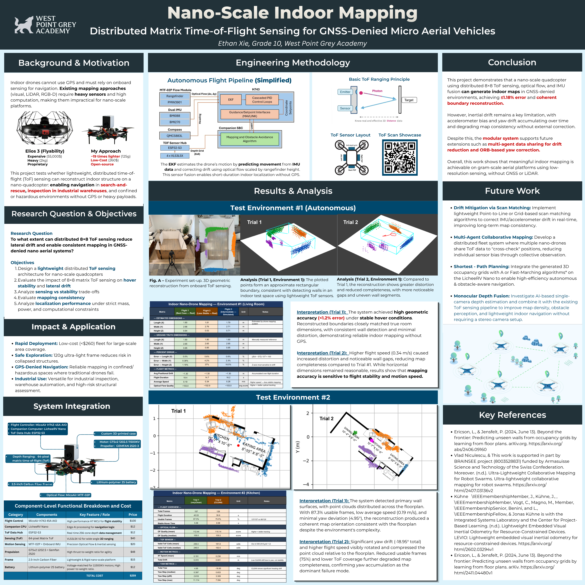
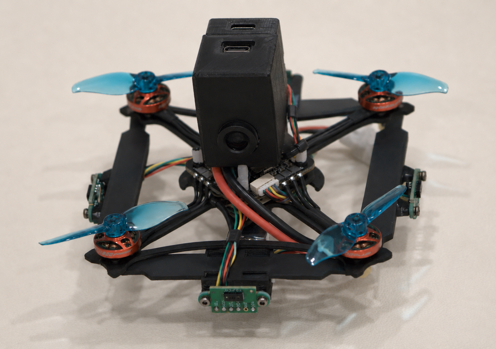
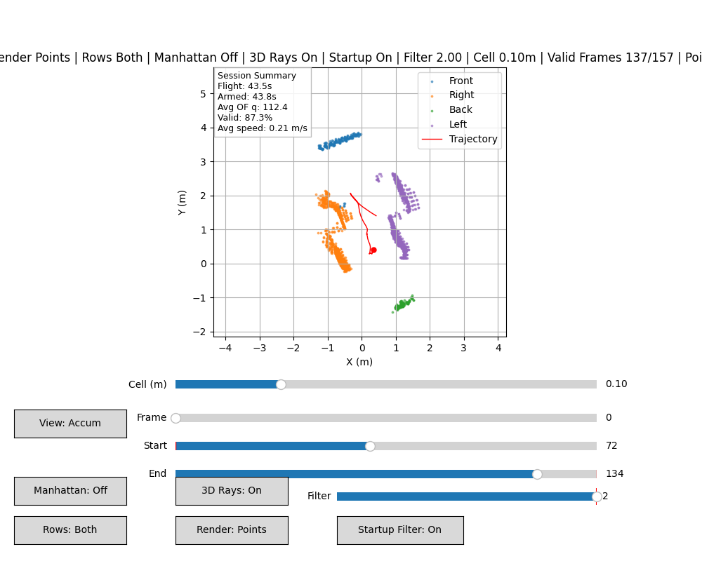

# Indoor GPS-Denied Nano-Quadcopter Mapping

## Overview

This project investigates whether a nano-scale quadcopter can perform autonomous indoor localization and mapping without GPS under strict size, power, and computational constraints.

The system combines optical flow velocity estimation, time-of-flight (ToF) depth sensing, and a lightweight companion-computer logging pipeline to reconstruct a 2D map of the environment from flight data.

The goal is to explore whether a highly constrained nano-quadcopter platform can support GPS-denied navigation and mapping for applications such as search-and-rescue, structural inspection, and confined-space exploration.

The full project — methodology, results, and analysis — is summarized in the science fair poster below:


*Figure: Science fair poster presenting the system design, methodology, and key findings.*


*Figure: Earlier prototype of the nano-quadcopter platform

---


## Features

- GPS-denied indoor flight
- Optical flow-based velocity estimation
- ToF-based environment sensing
- Modular sensor and compute architecture
- Companion-computer logging pipeline
- Post-flight 2D map reconstruction

---

## System Architecture

The system consists of three main subsystems:

1. **Flight Controller**  
   Handles stabilization and low-level control

2. **Sensor Hub (ESP32-S3)**  
   Collects and transmits ToF and related sensor data

3. **Companion Computer (LicheeRV Nano / earlier Luckfox Pico Mini B)**  
   Logs flight and sensor data for post-flight reconstruction and analysis

Data flow:

Sensors → ESP32-S3 → Companion Computer → Post-processing → 2D Map

---

## Hardware

### Version 1

| Component | Part |
|-----------|------|
| Sensor Hub | Waveshare ESP32-S3 Zero |
| Mapping / Vision SBC | Luckfox Pico Mini B |
| Flight Controller | MicoAir H743 45A V2 AIO |
| Motors | 1202.5 11500KV |
| Frame | 85mm Mobula8 Whoop Frame |

### Version 2

| Component | Part |
|-----------|------|
| Sensor Hub | Waveshare ESP32-S3 Zero |
| Mapping / Vision SBC | LicheeRV Nano |
| Flight Controller | MicoAir H743 45A V2 AIO |
| Motors | 1103 11000KV |
| Frame | 2" Carbon Fiber |

### Version 3 (Current)

| Component | Part |
|-----------|------|
| Sensor Hub | Waveshare ESP32-S3 Zero |
| Mapping / Vision SBC | LicheeRV Nano |
| Flight Controller | MicoAir H743 45A V2 AIO |
| Motors | 1202.5 11500KV |
| Frame | 2.5" Carbon Fiber |
| Propellers | 2.5" Bi-blade |

Approximate AUW: ~135g  
Battery: 2S LiHV

---

## Control & Tuning

### January 30, 2026

### Roll & Pitch

| Parameter | Value |
|-----------|-------|
| ATC_RAT_RLL_P | 0.07 |
| ATC_RAT_PIT_P | 0.07 |
| ATC_RAT_RLL_I | 0.06 |
| ATC_RAT_PIT_I | 0.06 |
| ATC_RAT_RLL_D | 0.0045 |
| ATC_RAT_PIT_D | 0.0045 |

### Yaw

| Parameter | Value |
|-----------|-------|
| ATC_RAT_YAW_P | 0.05 |
| ATC_RAT_YAW_I | 0.015 |
| ATC_RAT_YAW_D | 0.0 |

---

## Results

Test flights were conducted in small indoor environments.

Key observations:

- Stable hover was achieved using optical flow-based velocity estimation
- Short-duration mapping is feasible on a nano-scale platform
- Drift accumulation remains a major limitation
- ToF sensing introduces distortion and curvature artifacts in reconstructed maps
- The project demonstrates the practicality of modular indoor mapping on a constrained quadcopter platform

---

## Mapped Environment


.png)

---

## Repository Structure

- `README.md` — project overview, hardware versions, tuning notes, and results
- `clean_uav_fc_tof_nav.c` — autonomous flight and navigation code
- `manual_uav_fc_tof_nav.c` — manual flight controller version with logging
- `uav_local_nav.c` — local navigation logic
- `plot_scan.py` — mapping / scan visualization script
- `tof_esp32.ino` — ESP32 sensor hub firmware
- `m5stack_armDisarm.ino` — M5Stack arm/disarm helper
- `image (9).png` — example mapped environment output

---

## Build

### SCP Command: log.txt
```
scp root@10.98.143.1:/mnt/sdcard/log.txt "$env:USERPROFILE\Downloads\log.txt"
```
### SCP Command: scanlog.bin
```
scp root@10.98.143.1:/mnt/data/scanlog.bin "$env:USERPROFILE\Downloads\scanlog.bin"
```
### Compile Command

```bash
riscv64-linux-gnu-gcc -Os -std=gnu11 -w -static \
  -ffunction-sections -fdata-sections -Wl,--gc-sections \
  -I"$HOME/c_library_v2" \
  clean_uav_fc_tof_nav.c -o uav_fc_tof_nav_riscv_static -lm
