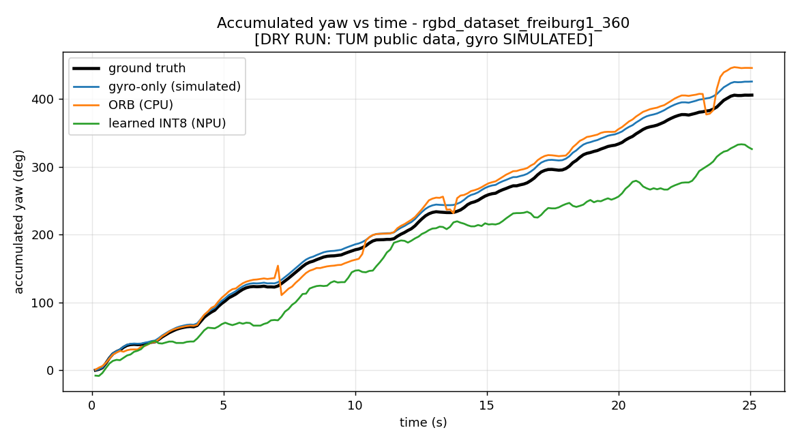
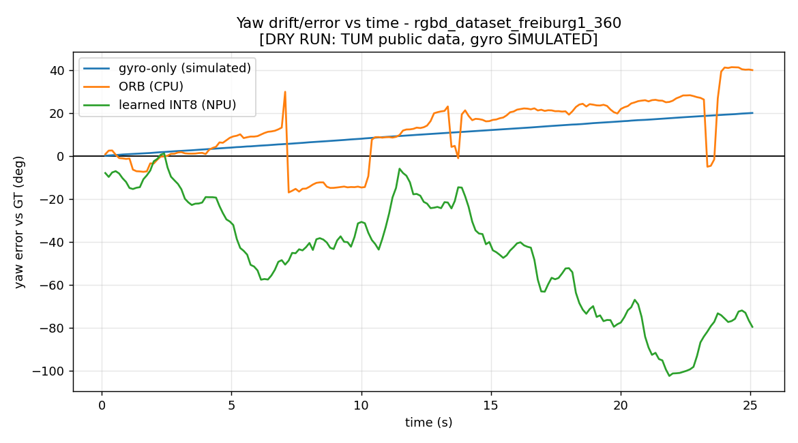

# Learned Visual Yaw-Correction — Pipeline DRY RUN

> ## ⚠️ THIS IS A DRY RUN — PLUMBING VALIDATION, NOT A SCIENTIFIC RESULT
> - Runs on a **public dataset (TUM RGB-D)**, not the target hardware's data.
> - The **gyro signal is SIMULATED** from ground-truth angular rate plus a
>   constant bias (0.8 °/s) and Gaussian noise (0.15 °/s) — TUM has no gyro.
> - The purpose is to prove the **entire chain runs end to end and produces real
>   plots from real data**, so that swapping in `RealRigDataset` (your captured
>   data) is the only remaining step. Real-data results are **pending**.

## Why TUM (and not EuRoC)
EuRoC MAV was the first choice (real synchronized cam + IMU + GT). Its official
host `robotics.ethz.ch` was **unreachable from this environment** (connection
timeout, 100 % packet loss). Per plan, I fell back to **TUM RGB-D** (real camera +
GT pose) and **simulated the gyro** from GT angular rates — clearly labeled as
simulated everywhere.

## Setup
| | |
|---|---|
| Train sequences | `fr1_desk`, `fr1_rpy` (whole sequences) |
| Test sequence (held out) | `fr1_360` — yaw-dominant, **no frame-level leakage** |
| Model | `YawNet`: 2×128×128 frame pair → (sin, cos) of relative yaw; ~Conv×5 + GAP + FC, tanh-bounded |
| Yaw convention | rotation about camera vertical axis; identical for GT / gyro / ORB / learned (see `geometry.py`) |
| Frame stride | 4 (pairs ~7.5 Hz); integration uses **non-overlapping** steps |
| Target hardware | LicheeRV Nano (SG2002, cv181x), INT8 on NPU via `model_runner` |

## Pipeline stages (all ran on real data)
`prep → train → convert(INT8) → deploy(NPU) → compare`

- **Train:** best val MAE = **1.76°** (epoch 8). In-distribution fit is near-perfect
  (corr 0.995 on a train seq); held-out generalization is partial (corr ≈ 0.41,
  slope ≈ 0.59 on `fr1_360`) due to the desk/rpy → panning **domain gap**.
- **Convert:** ONNX → INT8 `.cvimodel` (cv181x), calibrated on **80 real held-out
  frames** from `fr1_360`.
- **Deploy:** **752 real INT8 inferences on the NPU**, **3.29 ms/inf (304 FPS)**.

## Comparison — accumulated yaw over the held-out test sequence
`fr1_360`, 188 non-overlapping steps, **GT total yaw = 405.4°**, ORB failed pairs = 0.

| Method | Final drift (°) | RMS error (°) | Max error (°) |
|---|--:|--:|--:|
| gyro-only (SIMULATED) | **+20.0** | 11.6 | 20.0 |
| ORB (CPU) | +39.9 | 18.8 | 41.3 |
| learned INT8 (NPU) | −79.5 | 52.9 | 102.3 |

**INT8 vs FP32 (quantization cost):** per-pair MAE **0.27°**; final-drift difference
**6.1°** (FP32 −85.6° → INT8 −79.5°). Quantization barely changes accuracy.




## Honest reading of these numbers (dry run)
- The **gyro drift is exactly the injected bias** (0.8 °/s × ~25 s ≈ 20°) — confirms
  the gyro arm and the "drifts unbounded" expectation. With a longer sequence its
  error grows without bound, unlike the vision methods.
- **ORB** does well here because `fr1_360` is texture-rich, well-lit, slow rotation —
  ideal for feature matching. On the real rig (motion blur, low light) expect worse.
- The **learned model is currently the weakest arm**, under-tracking the rotation.
  This is the expected consequence of the **domain gap** (trained on translation/
  mixed-rotation desk-scale motion, tested on a pure 360° pan) plus aggressive
  128×128 downsampling. It is **not** a verdict on the approach — it is exactly the
  kind of finding a dry run exists to surface. With matched real-rig train/test data
  it should improve markedly.
- **Plumbing is fully validated:** real public data flowed through train → INT8 →
  on-NPU inference → 3-way drift comparison with real plots, no fabricated numbers.

## To run on YOUR hardware data
1. Implement `RealRigDataset.sequences()` in `datasets.py` (frames + GT pose +
   **real** gyro; set `gyro_is_simulated = False`). See its docstring.
2. Set `dataset.adapter: real_rig` in `config.yaml`.
3. `python3 run_pipeline.py` — nothing else changes.

## Reproduce
```bash
pip install torch onnx onnxruntime opencv-python pyyaml matplotlib tpu_mlir
python3 run_pipeline.py                 # prep -> train -> convert -> deploy -> compare
# or resume: python3 run_pipeline.py --start convert
```
Artifacts (plots, metrics) are in `results/`. Heavy intermediates land in `work/` (gitignored).
